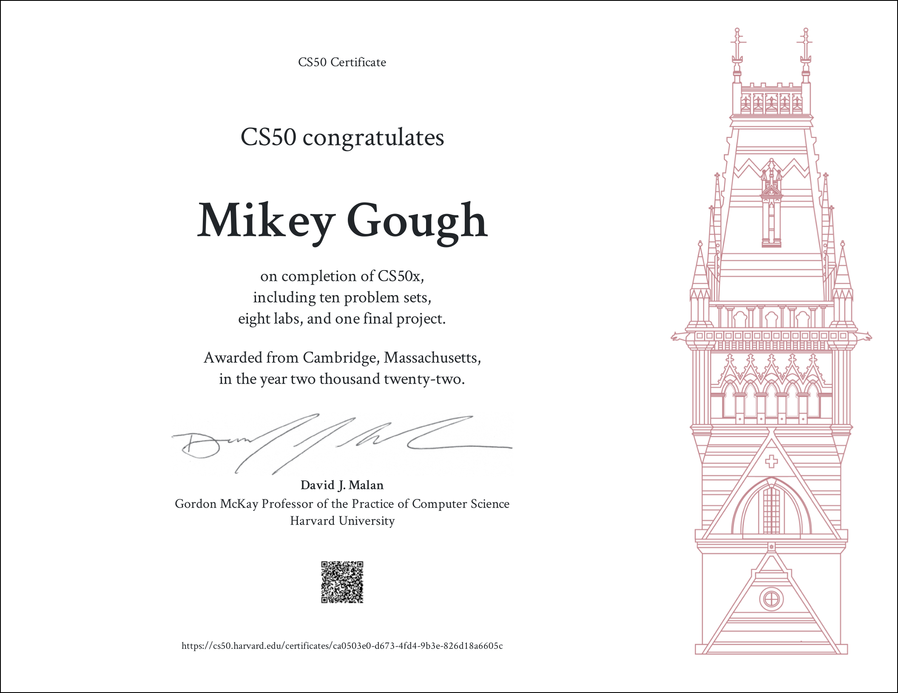

# cs50x
Harvard CS50X: Introduction to Computer Science

#### [CS50X](https://bit.ly/3TD8gFk)
an introductory computer science course that teaches students how to think algorithmically and solve problems efficiently. the course is ten weeks and consists of weekly lectures and problem sets, ultimately culminating in a [final project](https://github.com/mikeygough/run100miles). the course covered the topics listed below but by no means do i claim to be an expert in them, just have some exposure!

<ul>
  <li>C</li>
  <li>Arrays</li>
  <li>Algorithms</li>
  <li>Memory</li>
  <li>Data Structures</li>
  <li>Python</li>
  <li>SQL</li>
  <li>HTML, CSS & Javascript</li>
  <li>Flask</li>
</ul>

